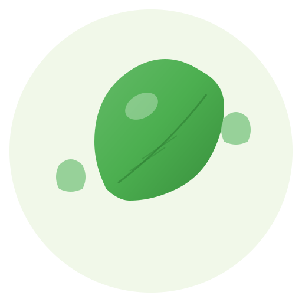

# 🌱 PlantMeet (遇见植物)

<div align="center">
  
  
  **A "small and beautiful" plant identification app for students and plant enthusiasts**
  
  [](https://flutter.dev)
  [](https://dart.dev)
  [](#)
  
  [简体中文](README_zh.md) | English
</div>

## 📖 About

PlantMeet is a minimalist plant identification app designed for students and plant enthusiasts. It focuses on three core features: **identification**, **recording** (with smart deduplication), and **export**. The app uses a hybrid recognition approach combining local MNN chat API (primary) with optional cloud API (BYOK - Bring Your Own Key).

### Design Philosophy: "Small and Beautiful" (小而美)

- **Minimalist**: Only identification, recording, and export - nothing more
- **Local-first**: Default to local processing for zero cost and privacy
- **Smart deduplication**: Merge same plant species with multiple encounter records
- **Export-focused**: PDF generation for physical field guides
- **Privacy-conscious**: Local storage by default, optional cloud with user consent

## ✨ Features

### 🔍 Plant Identification
- **Local Recognition**: Primary identification using local MNN chat API
- **Cloud Backup**: Optional cloud recognition with user-provided API keys (BYOK)
- **Capture First**: Stable "capture then identify" approach instead of real-time preview

### 📔 Smart Recording
- **My Plant Guide**: Personal collection of identified plants
- **Encounter Tracking**: Record multiple meetings with the same species
- **Smart Deduplication**: Automatically merge duplicate species
- **Rich Records**: Time, location, photos, and personal notes for each encounter

### 📄 Export & Share
- **PDF Export**: Generate beautiful field guides for printing
- **Offline Access**: All data available without internet connection
- **Privacy Control**: Data stays local unless explicitly shared

## 🚀 Getting Started

### Prerequisites

- Flutter SDK 3.8.1 or higher
- Dart 3.0 or higher
- Android Studio / VS Code with Flutter extensions
- For Android: Android SDK 21+ (Android 5.0+)
- For iOS: iOS 11.0+

### Installation

1. **Clone the repository**
   ```bash
   git clone https://github.com/GaoCan702/PlantMeet.git
   cd PlantMeet
   ```

2. **Install dependencies**
   ```bash
   flutter pub get
   ```

3. **Run the app**
   ```bash
   flutter run
   ```

### Building

#### Android
```bash
# Debug APK
flutter build apk --debug

# Release APK
flutter build apk --release

# App Bundle (for Play Store)
flutter build appbundle --release
```

#### iOS
```bash
flutter build ios --release
```

#### Web
```bash
flutter build web
```

## 🔑 本地运行时设置 Token（Hugging Face）

项目已移除硬编码的 Hugging Face Token。若需要访问受限资源，请在运行/构建时通过 `--dart-define` 注入 `HF_ACCESS_TOKEN`。

### 开发运行

```bash
# 直接注入
flutter run --dart-define=HF_ACCESS_TOKEN=hf_xxx_your_token

# 或使用环境变量（推荐，将 token 保存在 shell 配置中）
export HF_ACCESS_TOKEN=hf_xxx_your_token
flutter run --dart-define=HF_ACCESS_TOKEN=$HF_ACCESS_TOKEN
```

### 构建发布

```bash
# Android Release APK
flutter build apk --release --dart-define=HF_ACCESS_TOKEN=$HF_ACCESS_TOKEN

# Android App Bundle
flutter build appbundle --release --dart-define=HF_ACCESS_TOKEN=$HF_ACCESS_TOKEN

# iOS Release（需要在 macOS 且已配置签名）
flutter build ios --release --dart-define=HF_ACCESS_TOKEN=$HF_ACCESS_TOKEN
```

### CI 中的用法（示例）

在 CI 平台将 Token 存为机密变量，例如 `HF_ACCESS_TOKEN`，然后：

```bash
flutter build apk --release --dart-define=HF_ACCESS_TOKEN=$HF_ACCESS_TOKEN
```

### 注意事项

- 不要将 Token 写入代码或提交到仓库。
- `String.fromEnvironment('HF_ACCESS_TOKEN')` 在构建时会内嵌常量；生产环境不建议将敏感 Token 打进最终产物。
  - 建议：仅在开发/内测阶段使用该方式；如需线上下载受限资源，请改为通过服务端代理或用户自行提供密钥。
- 未提供 `HF_ACCESS_TOKEN` 时，代码会以匿名方式访问（可能受限）。

## ⚡ 性能优化

### 冷启动优化
应用已实施以下冷启动优化策略：

- **延后模型初始化**：AI模型初始化延后到首帧渲染后执行，避免阻塞应用启动
- **本地模型校验**：启动时仅做本地模型文件校验，不进行内存加载
- **按需加载**：AI模型仅在实际使用时才加载到内存，减少启动时间
- **后台初始化**：模型服务在后台异步初始化，不影响UI响应

### Android优化
- 启用 `OnBackInvokedCallback` 支持现代Android返回手势
- 硬件加速和窗口优化配置

## 🏗️ Architecture

### Project Structure
```
lib/
├── main.dart              # App entry point
├── models/               # Data models
│   ├── plant_species.dart
│   ├── plant_encounter.dart
│   └── recognition_result.dart
├── screens/             # UI screens
│   ├── home_screen.dart
│   ├── camera_screen.dart
│   ├── gallery_screen.dart
│   └── settings_screen.dart
├── services/            # Business logic
│   ├── database_service.dart
│   ├── recognition_service.dart
│   └── pdf_export_service.dart
└── widgets/            # Reusable UI components
```

### Tech Stack

#### Core Framework
- **Flutter**: Cross-platform UI framework
- **Dart**: Programming language

#### State Management
- **Provider**: Simple and scalable state management

#### Database & Storage
- **Drift**: Type-safe SQL database (SQLite)
- **SharedPreferences**: Simple key-value storage
- **Path Provider**: File system path access

#### Networking & APIs
- **HTTP**: RESTful API client
- **Camera**: Photo capture functionality
- **Image Picker**: Gallery photo selection

#### Features
- **PDF**: Document generation and export
- **Geolocator**: Location services
- **Share Plus**: System sharing integration
- **Permission Handler**: Runtime permissions

#### Development
- **Flutter Lints**: Code quality and style
- **Build Runner**: Code generation
- **Mocktail**: Testing framework

## 🎯 Key Components

### Data Models
- **Species**: Unique plant entries with taxonomic ID
- **Encounter**: Individual sightings with time, location, photos, notes
- **Recognition Results**: Top-3 candidates with confidence scores

### Services
- **Recognition Service**: Handles both local and cloud plant identification
- **Database Service**: Manages local data storage and smart deduplication
- **PDF Export Service**: Generates printable field guides
- **Permission Service**: Manages camera and location permissions

## 🛠️ Development

### Code Style
- Follow Dart/Flutter standard style guidelines
- Use `flutter_lints` for code quality
- Prefer single quotes for strings
- Run `flutter format .` before committing

### Testing
```bash
# Run all tests
flutter test

# Run with coverage
flutter test --coverage

# Static analysis
flutter analyze
```

### Quality Checks
```bash
# Format code
flutter format .

# Analyze code
flutter analyze

# Run tests
flutter test
```

## 📱 Supported Platforms

- ✅ **Android**: API 21+ (Android 5.0+)
- ✅ **iOS**: iOS 11.0+
- ✅ **Web**: Modern browsers
- ✅ **macOS**: macOS 10.14+
- ✅ **Windows**: Windows 10+
- ✅ **Linux**: Ubuntu 20.04+

## 🎨 Brand & Assets

### Logo System
The PlantMeet logo is based on Material Design's eco icon, representing our connection to nature and sustainability.

- **Logo Files**: Available in `assets/logo/`
- **SVG Sources**: `logo_base.svg` (detailed) and `logo_simple.svg` (simplified)
- **Generated Icons**: Automated generation script for all platform requirements

### Icon Generation
```bash
cd assets/logo
python generate_icons.py
```

This generates 32 icons across all platforms:
- Android: 5 density variants
- iOS: 15 size variants
- Web: 5 icon types
- macOS: 7 size variants

## 🔐 Privacy & Security

### Local-First Approach
- All plant data stored locally by default
- No data uploaded without explicit user consent
- Cloud recognition only with user-provided API keys

### Permissions
- **Camera**: Required for plant photography
- **Storage**: For saving photos and PDF exports
- **Location**: Optional, for encounter tracking

## 📋 Roadmap

### Version 1.0 (MVP) - Current
- [x] Basic plant identification
- [x] Local data storage
- [x] Photo capture and gallery
- [x] Settings and onboarding
- [x] Brand identity and icons

### Future Enhancements
- [ ] Local MNN model integration
- [ ] Cloud API integration (BYOK)
- [ ] PDF export functionality
- [ ] Advanced plant details
- [ ] Location-based encounters
- [ ] Improved UI/UX

## 🤝 Contributing

This is currently a private project. For development guidelines, see [CLAUDE.md](CLAUDE.md).

## 📄 Documentation

- **[CLAUDE.md](CLAUDE.md)**: Development guidelines for Claude Code
- **[plantmeet_prd.md](plantmeet_prd.md)**: Product requirements (Chinese)
- **[Logo Generation Guide](assets/logo/generate_icons.md)**: Icon creation process

## 🐛 Issues & Support

For issues and feature requests, please contact the development team.

## 📊 Project Stats

- **Package**: `com.arousedata.plantmeet`
- **Version**: 1.0.0+1
- **Flutter**: 3.8.1+
- **Platforms**: 6 supported
- **Dependencies**: 20+ production packages

---

<div align="center">
  <sub>Built with ❤️ using Flutter</sub>
</div>